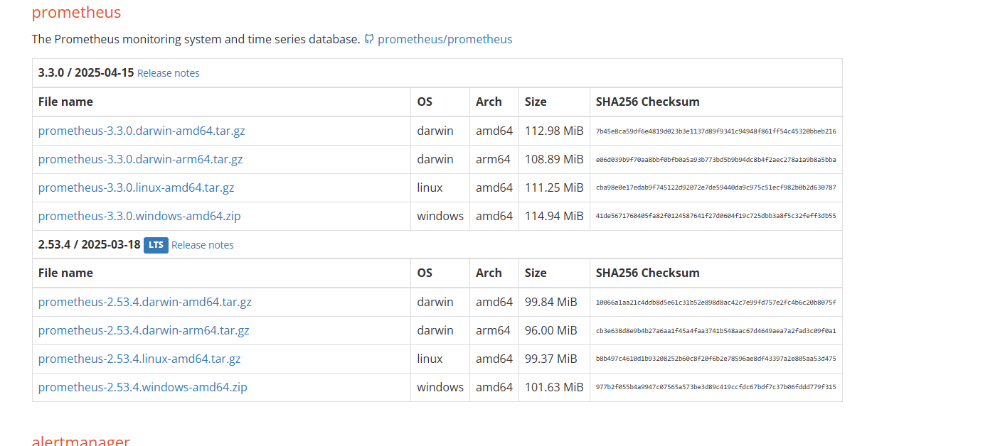
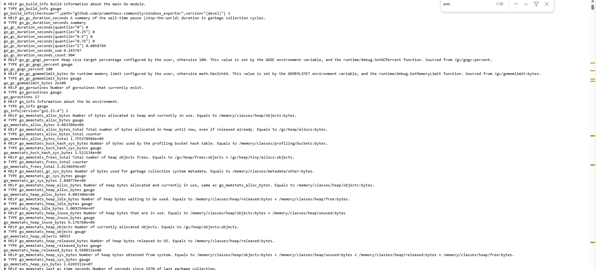
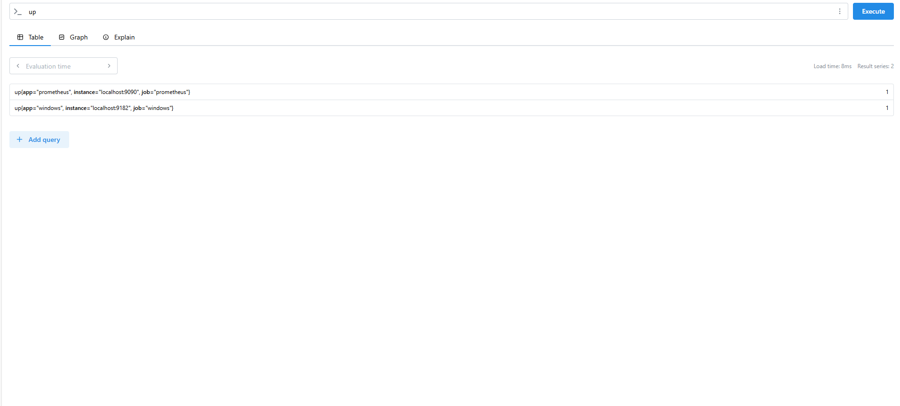
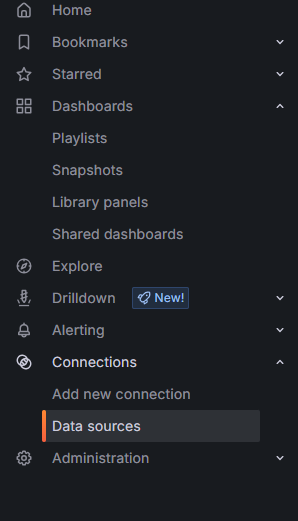
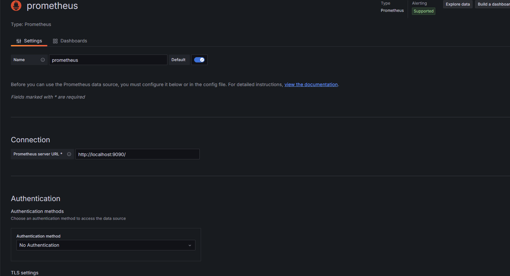
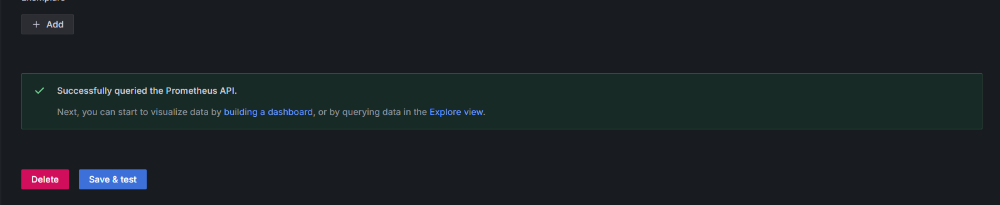
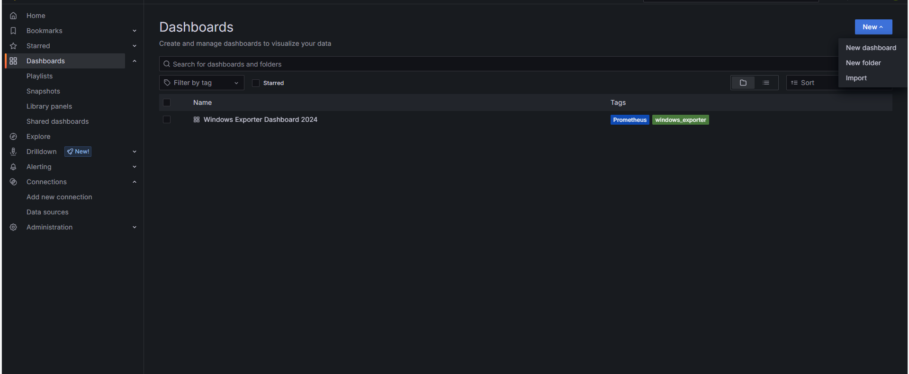
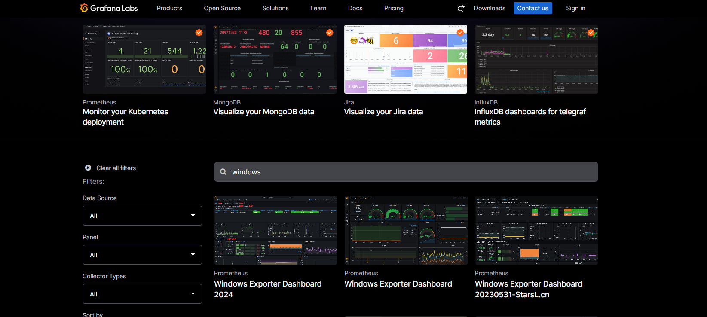
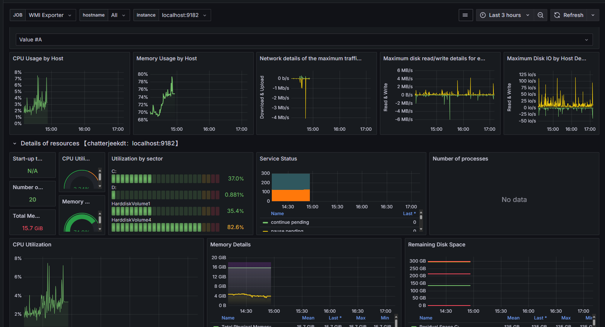

# Monitoring Windows metrics using Grafana and Prometheus

## Install  the tools:
- Grafana: https://grafana.com/grafana/download?platform=windows
- Prometheus: https://prometheus.io/download/

- NSSM: https://nssm.cc/download
- Windows Exporter: https://github.com/prometheus-community/windows_exporter/releases

## What is Grafana?
Grafana open source software enables you to query, visualize, alert on, and explore your metrics, logs, and traces wherever they are stored. Grafana OSS provides you with tools to turn your time-series database (TSDB) data into insightful graphs and visualizations. The Grafana OSS plugin framework also enables you to connect other data sources like NoSQL/SQL databases, ticketing tools like Jira or ServiceNow, and CI/CD tooling like GitLab.

## What is Prometheus?
Prometheus is an open-source systems monitoring and alerting toolkit originally built at SoundCloud. Since its inception in 2012, many companies and organizations have adopted Prometheus, and the project has a very active developer and user community. It is now a standalone open source project and maintained independently of any company.Prometheus collects and stores its metrics as time series data, i.e. metrics information is stored with the timestamp at which it was recorded, alongside optional key-value pairs called labels.

## What are metrics?
Metrics are numerical measurements in layperson terms. The term time series refers to the recording of changes over time. What users want to measure differs from application to application. For a web server, it could be request times; for a database, it could be the number of active connections or active queries, and so on.

## What is Windows Exporter?
Windows Exporter is a Prometheus exporter for Windows machines, designed to collect and expose various metrics from Windows systems. It provides a wide range of collectors for different aspects of Windows, including CPU, memory, disk, network, and more, making it an essential tool for monitoring Windows environments with Prometheus.

### Pros
- Comprehensive coverage of Windows-specific metrics
- Highly configurable with numerous collectors available
- Easy integration with existing Prometheus setups
### Cons
- Limited to Windows environments
- Configuration can be complex for advanced scenarios

## What is NSSM?
NSSM (Non-Sucking Service Manager) is a free, open-source tool for Windows that allows you to easily run any application (including scripts like Python, Node.js, or Java programs) as a Windows Service.

- Run any executable as a service
- Capture stdout/stderr logs from applications.
- Auto-recovery if the application crashes.

## Install Grafana
Step 1: Navigate to the folder where you have downloaded the grafana MSI. <br>
Step 2: Click on the installer and proceed to install the software. <br>
Step 3: Run _localhost:3000_ to spin up Grafana. <br>
Step 4: Use **_admin_** as username and password to login. <br>

Sep 5: Give new password for Grafana and you are done. <br>


## Install Prometheus
Step 1: Open the powershell as administrator and change the directory using the path where NSSM is located:
```bash
cd D:\nssm-2.24\nssm-2.24\win64
```
Step 2: Add it to  Environmental Variables of your system<br>

Step 3: Execute the command to install Prometheus in your system.
```bash
 nssm.exe install prometheus D:\prometheus-3.3.0.windows-amd64\prometheus-3.3.0.windows-amd64\prometheus.exe
```
step 4: It should display
```
Service "prometheus" installed successully!
```

## Install Windows Exporter
 Step 1: Navigate to  the folder/drive where windows exporter is downloaded and install it on a folder. <br>
 Step 2: Check it's running by hitting _http://localhost:9182/metrics_ on your browser
 

 ## Start prometheus as Service
 Step 1: Go to directory where prometheus is installed and modify the prometheus.yml file.
 ```
 D:\prometheus-3.3.0.windows-amd64\prometheus-3.3.0.windows-amd64
 ```

 Step 2: Add another job as windows exporter inside it.
```
# my global config
global:
  scrape_interval: 15s # Set the scrape interval to every 15 seconds. Default is every 1 minute.
  evaluation_interval: 15s # Evaluate rules every 15 seconds. The default is every 1 minute.
  # scrape_timeout is set to the global default (10s).

# Alertmanager configuration
alerting:
  alertmanagers:
    - static_configs:
        - targets:
          # - alertmanager:9093

# Load rules once and periodically evaluate them according to the global 'evaluation_interval'.
rule_files:
  # - "first_rules.yml"
  # - "second_rules.yml"

# A scrape configuration containing exactly one endpoint to scrape:
# Here it's Prometheus itself.
scrape_configs:
  # The job name is added as a label `job=<job_name>` to any timeseries scraped from this config.
  
  - job_name: "prometheus"

    # metrics_path defaults to '/metrics'
    # scheme defaults to 'http'.

    static_configs:
      - targets: ["localhost:9090"]
       # The label name is added as a label `label_name=<label_value>` to any timeseries scraped from this config.
        labels:
          app: "prometheus"
  - job_name: "windows"

    # metrics_path defaults to '/metrics'
    # scheme defaults to 'http'.

    static_configs:
      - targets: ["localhost:9182"]
       # The label name is added as a label `label_name=<label_value>` to any timeseries scraped from this config.
        labels:
          app: "windows"

```
 
Step 3: Inside the powershell execute the command:
 ```bash
 nssm start prometheus
 ```


## See your services on Prometheus
Step 1: Visit http://localhost:9090 on your browser to spin up prometheus.
<br>Step 2. Inside query box write _up_ and click execute to see the jobs running.


## See your grafana dashboard
Step 1: Navigate to http://localhost:3000 <br>
Step 2: Click on collections and select data source. <br>
 <br>
Step 3: Select Prometheus and inside prometheus server url write:
```
http://localhost:9090
```

Step 4: Click on save and test.


Step 5: Go to dashboard and click on new and select import.


Step 6: Click on https://grafana.com/grafana/dashboards and search for windows exporter dashboard and download the json



Step 7: Click on upload dashboard json file and select the json and you are done:
